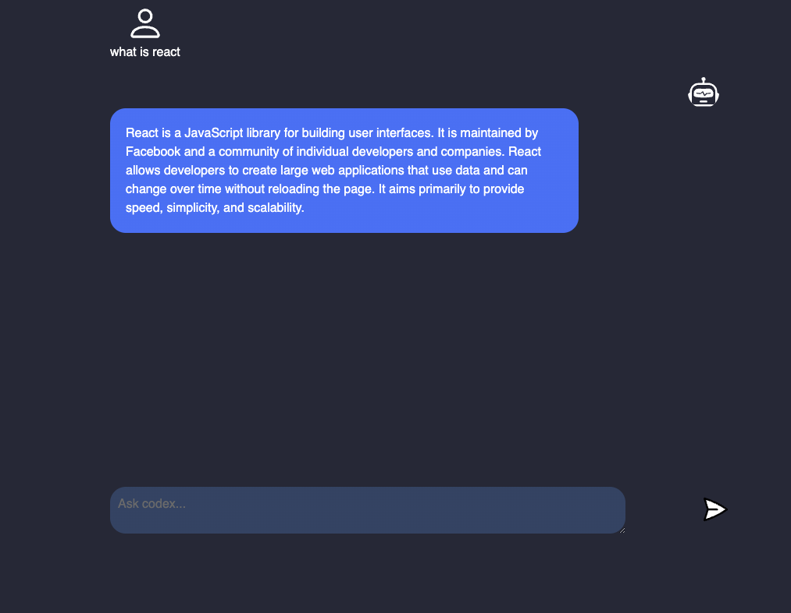

<h1>chatBot</h1>

    
This project is a simple chatbot that utilizes the power of Vite, Express, and the OpenAI API to provide users with a conversational experience.

<h3>Usage</h3>
    <ol>
      <li>Type your question or statement in the input field and press enter.</li>
      <li>The chatbot will respond with an answer generated by the OpenAI API.</li>
    </ol>

<h3>Deployment</h3>
    
This project is deployed using render

<h3>Built With</h3>
   <ul>
      <li><a href="https://github.com/vitejs/vite">Vite</a> - The web development build tool used</li>
      <li><a href="https://expressjs.com/">Express</a> - The web framework used</li>
      <li><a href="https://openai.com/">OpenAI API</a> - The AI model used for generating responses</li>
    </ul>